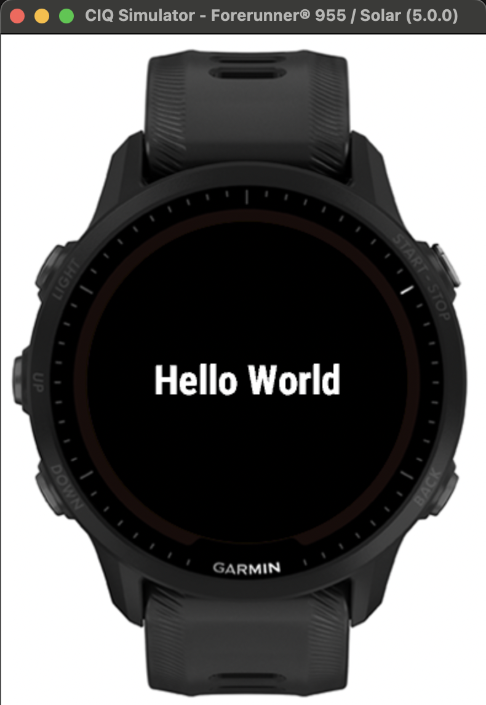

# GarminBytePacking

## Introduction

In this repository we introduce a Garmin library (aka monkey barrel) in `BytePacking/` directory that adds functions for manipulating ByteArrays, Floats, Doubles and Longs.

Here are the core functions (see [here](https://github.com/mannyray/GarminBytePacking/blob/master/BytePackingTesting/source/FloatTest.mc#L100) for the code example):

```javascript
var someLong = 123l;
var byteArray = BytePacking.BPLong.longToByteArray(someLong);
Test.assert(byteArray.equals([0x00,0x00,0x00,0x00,0x00,0x00,0x00,0x7B]b));
Test.assert(BytePacking.BPLong.byteArrayToLong(byteArray) == someLong);

var someFloat = 123.34f;
byteArray = BytePacking.BPFloat.floatToByteArray(someFloat);
Test.assert(byteArray.equals([0x42,0xF6,0xAE,0x14]b));
Test.assert(BytePacking.BPFloat.byteArrayToFloat(byteArray) == someFloat);

var someDouble = 1234578.65432d;
byteArray = BytePacking.BPDouble.doubleToByteArray(someDouble);
Test.assert(byteArray.equals([0x41,0x32,0xD6,0x92,0xA7,0x81,0x83,0xF9]b));
Test.assert(BytePacking.BPDouble.byteArrayToDouble(byteArray) == someDouble);
```

In fact, the `floatToByteArray`/`byteArrayToFloat` pair have already been implemented by Garmin's built in methods to ByteArray data type via [encodeNumber and decodeNumber](https://developer.garmin.com/connect-iq/api-docs/Toybox/Lang/ByteArray.html#encodeNumber-instance_function) (and can be seen tested in this [repo](https://github.com/mannyray/GarminBytePacking/blob/master/BytePackingTesting/source/FloatTest.mc#L14-L23)). However, these methods can only handle number formats of up to 32 bits. This exclusion of 64 bit numbers was the motivation of this library which adds the conversion to Longs and Doubles. Since Floats and Double are similar in their bit structure, the the Float implementation easily led to the Double implementation.

The motivation for the word "packing" was due to the desire to have the ability to pack various variables and data within a single Long or Double. Let me explain with an example: 

> Let's say you have heart rate data (beats per minute - bpm) for each second over 8 second period: `[100bpm, 99bpm, 95bpm, 91bpm, 87bpm, 83bpm, 81bpm, 80bpm ]`. Each of these heart rate numbers can be stored as a byte since the range of a byte is from 0 to 255. Therefore, in bit notation, our array becomes: `[01100100,01100011,01011111,01011011,01010111,01010011,01010001,01010000]` (see this [tool](https://www.rapidtables.com/convert/number/decimal-to-binary.html) for conversion assistance). Then, this array of 64 bits total (8 numbers \* 8 bits per byte) becomes 64 bits and in Double form is equivalen to the number `3.8331240896774276e+175` (see this [tool](https://baseconvert.com/ieee-754-floating-point)). We converted the 8 heart beats to a single Double!

In our example above we are packing heart beat into a single double - why would we do that? Sounds a little convoluted  - no? Garmin apps allow the developer to store data to a FIT data file during activities. Garmin allows the developer to [create _fields_](https://developer.garmin.com/connect-iq/api-docs/Toybox/ActivityRecording/Session.html#createField-instance_function) for each of their various data types (e.g. heart rate), but these can be limiting:
 - You may be restricted by the amount of fields you can create. (see forum post [[1]](https://forums.garmin.com/developer/connect-iq/f/discussion/234758/what-is-the-limiting-number-of-developer-fields-that-can-be-added-under-session), [[2]](https://forums.garmin.com/developer/connect-iq/i/bug-reports/please-can-the-sdk-documentation-be-more-developer-friendly-and-searchable-and-complete), [[3]](https://forums.garmin.com/developer/connect-iq/f/app-ideas/274591/why-the-limitation-to-2-custom-data-fields)). In my personal Garmin 955 solar device app, I was only allowed _one_ field which fueled my desire to pack as much data into one field as possible. Field count restriction can be difficult if you are trying to store a variety of data types (e.g. not just heart rate data but say also some speed data). Now you can just pack the data into one 64 bit field.
 - You may have sub second high frequency data which Garmin's field is [not equipped to handle](https://developer.garmin.com/connect-iq/api-docs/Toybox/FitContributor/Field.html)): `If setData() is called before the previous data is written out, the previous value will be lost and replaced by the current data. For this reason, we do not recommend using this feature for time-sensitive data requiring sub-second granularity.`. You can save up your high frequency data over a second period, pack them into a single Double and the save it. (A link to a forum posts of someone trying to handle high frequency data [[1]](https://forums.garmin.com/developer/connect-iq/f/discussion/353139/save-high-frequency-accelerometer-and-gyroscope-data-to-fit-file), [[2]](https://forums.garmin.com/developer/connect-iq/f/discussion/320993/best-practice-to-record-sub-second-data-to-fit-file))
 - Other alternative approaches to saving the data may not work like logging the data to log file as its limit of 12kb (see [here](https://forums.garmin.com/developer/connect-iq/f/discussion/6311/device-log-size-limitation---alternate-sysout)) may be too small, but you need way more. For example according to [[1]](https://forums.garmin.com/developer/connect-iq/f/app-ideas/274591/why-the-limitation-to-2-custom-data-fields0) and [[2]](https://forums.garmin.com/developer/connect-iq/f/discussion/258441/maximum-memory-for-data-field-per-device), my 955 solar watch has 262kb memory for data fields. In addition, setting up a bluetooth connection to another device, like your cell phone to use it as a data store option while your Garmin devices collects/computes the data may be inconvenient, restrictive or time consuming to implement. 

## Example

In the previous section we introduced why we might need to pack various data into a Double. Let's practice with a code example below which is part of our test suite [here](https://github.com/mannyray/GarminBytePacking/blob/master/BytePackingTesting/source/LongTest.mc#L185). In this example we store various data as part of a `BytePacking.BPLongPacked()` object which under the hood used a Long to store the incoming data. This object makes sure we don't attempt to store too much into a single Long. Once we have finished storing we can call `BytePacking.BPLongPacked.getData()` which gives us the Long at which point we can convert it to ByteArray via the code seen at the beginning of this page. From the ByteArray we can convert to a Double.

```javascript
 /*
    We have a few numbers we want to pack into a 64 bit long
*/
var numbers = [
    523l, // 1000001011 - 10 digits
    8129l, // 1111111000001 - 13 digits
    654321l, // 10011111101111110001 - 20 digits
    9237l // 10010000010101 -  14 digits
    ];

// we specify the exact amount of bit digits required for each number
var bitsRequired = [10, 13, 20, 14];
/*
    pad one of the entries with zeros

    this is useful in scenarios where you have a varying data point within some range of
    say [0,255] (8 bit max range), but at times enter in data that doesn't require
    all the bits (say your data is 16 which is 5 binary digits), but for consistency and
    later on processing sake you want to make sure you always use the 8 bits which
    is why you would pad.
*/

bitsRequired[2]+= 1;
// we now have 58 bits to be stored

// Let's starting packing the data into the long:
var packed = new BytePacking.BPLongPacked();
for(var i=0; i<numbers.size(); i++){
    packed.addData(
        BytePacking.BinaryDataPair.binaryDataPairWithMaxBits(
            numbers[i],
            bitsRequired[i]
        )
    );
}

Test.assert(packed.getCurrentBitOccuputation()==58);

/*
    Our number is
    1000001011 1111111000001 0 10011111101111110001 10010000010101
    (that's the 58 up to now and the rest zeros) 000000
    or compacted 1000001011111111100000101001111110111111000110010000010101000000
    which according to
    https://www.rapidtables.com/convert/number/binary-to-decimal.html
    is equivalent to -9007337107100203712

    Out of 64 bits in long, 6 bits are maining as first 58 are used
*/
Test.assert(packed.getData() == -9007337107100203712l);

// we now try to pack something that does not fit into the remaining
// 6 bits ( 64 == 7 bits) and fail
try {
    packed.addData(new BytePacking.BinaryDataPair(64l));
    Test.assert(1 == 0);//should never be reached.
} catch (e instanceof Toybox.Lang.InvalidValueException) {
    var acquiredErrorMessage = e.getErrorMessage();
    var expectedErrorMessage = "We are already storing too much";
    Test.assertMessage(
        acquiredErrorMessage.find(expectedErrorMessage) != null,
        "Invalid error message. Got '" +
        acquiredErrorMessage +
        "', expected: '" +
        expectedErrorMessage +
        "'"
    );
}

//However 32 fits as it is 6 bits, but we first incorrectly try to fit in 5 bits
try {
    packed.addData(BytePacking.BinaryDataPair.binaryDataPairWithMaxBits(32l,5));
    Test.assert(1 == 0);//should never be reached.
} catch (e instanceof Toybox.Lang.InvalidValueException) {
    var acquiredErrorMessage = e.getErrorMessage();
    var expectedErrorMessage = "maxBitCount is less than actual bit count";
    Test.assertMessage(
        acquiredErrorMessage.find(expectedErrorMessage) != null,
        "Invalid error message. Got '" +
        acquiredErrorMessage +
        "', expected: '" +
        expectedErrorMessage +
        "'"
    );
}

/*
    BytePacking.BinaryDataPair.binaryDataPairWithMaxBits can be
    called when wanting a specific bit count
    or you can use the exact bit count needed for the
    long number by calling BytePacking.BinaryDataPair
*/
packed.addData(new BytePacking.BinaryDataPair(32l));

/*
    Our new long in bits is 
    1000001011111111100000101001111110111111000110010000010101100000
*/
Test.assert(packed.getData() == -9007337107100203680l);
Test.assert(packed.getCurrentBitOccuputation()==64);// no more bits left over

/*
    we now extract the byte array of the stored long
    and verify that it is equal to what is expected
*/
var byteArray = BytePacking.BPLong.longToByteArray(packed.getData());
// the bits in hex form
assertEquivalencyBetweenByteArrays(byteArray, [0x82,0xFF,0x82,0x9F,0xBF,0x19,0x05,0x60]b);

/*
    Now that we have the byte array of a long which is 64 bits, we can express it as 
    a double which is also 64 bits long
    value from https://baseconvert.com/ieee-754-floating-point
*/
Test.assert(BytePacking.BPDouble.byteArrayToDouble(byteArray)==-3.0835862373866053e-294d);
```

In the example above, we used a `BytePacking.BPLongPacked()`  object to store the incoming data. The incoming data was in long, integer, format. However, what if we need to store Floats? We can pack two of them into a Double (as seen in our [test code](https://github.com/mannyray/GarminBytePacking/blob/master/BytePackingTesting/source/FloatTest.mc#L82-L96))

```javascript
// using https://baseconvert.com/ieee-754-floating-point
        
var float1 = 1234.1234f; //0 10001001 00110100100001111110011
var float2 = -12345.243687f; //1 10001100 10000001110010011111010

var floatArr1 = BytePacking.BPFloat.floatToByteArray(float1);
var floatArr2 = BytePacking.BPFloat.floatToByteArray(float2);

var singleArr = floatArr1.addAll(floatArr2);
Test.assert(BytePacking.BPDouble.byteArrayToDouble(singleArr)==3.100875655157453e+22d);
```

In general, you can pack anything you want into a Double, as long as it all is within 64 bits.

## Watch App Example:

The examples above don't deal with actually saving to a Garmin data field. In `TestApp/`, we have a simple watch app for the 955 solar that displays "Hello World" and creates and saves a fit field just with our data.



Files `TestApp.mc`, `TestAppDelegate.mc` and `TestAppView.mc` provide the core structure of our skeleton app while `TestField.mc` provides an extremely basic setup for creating, closing a Garmin data field and saving data to it - there we mention that we are saving the data as as `DATA_TYPE_DOUBLE`:

```javascript
dataField = session.createField(
    "field",
    DATA_FIELD_ID,
    FitContributor.DATA_TYPE_DOUBLE,
    { :mesgType=>Fit.MESG_TYPE_RECORD }
);
```

within `TestApp.mc`'s initialization of the app we create the session for the Garmin field as well as setup a function that will be called regularly in order to save our data. 

```javascript
session = new Session();
/*
    Every 2000 milliseconds (number can't be less than a 1000 
    due to setData restrictions)
*/
timer.start( method(:onTimerTic),2000,true);
```

Within `onTimerTic`, we have the code that is similar to the one we saw in a previous example:
```javascript
var numbers = [523l, 8129l, 654321l, 9237l, 32l];
var bitsRequired = [10, 13, 20, 14, 6];
bitsRequired[2]+= 1;
var packed = new BytePacking.BPLongPacked();
for(var i=0; i<numbers.size(); i++){
    packed.addData(
        BytePacking.BinaryDataPair.binaryDataPairWithMaxBits(
            numbers[i],
            bitsRequired[i]
        )
    );
}
var byteArray = BytePacking.BPLong.longToByteArray(packed.getData());
var dataDoubleEquivalent = BytePacking.BPDouble.byteArrayToDouble(byteArray);
// now that we have converted the data to a double, we save it to FIT file
session.recordData(dataDoubleEquivalent);
```

After running the watch app, you will have generated a fit file. At this point, I am assuming if you, the reader, are digging this deep then you must be familiar with how to extract the fit file, generated by this watch app. We load it onto our computer and run the script located in `TestParsing/script.py`:
```python
import fitdecode

with fitdecode.FitReader('2025-02-07-16-28-55.fit') as fit:
    for frame in fit:
        if frame.frame_type == fitdecode.FIT_FRAME_DATA:
            if frame.name == "record":
                value = frame.fields[6].value
                print(value)
```
which will give us the expected value of `-3.0835862373866053e-294` (as seen in our previous example). Now to decode this value into the original numbers we encoded we add the following functions in the python script: `def double_to_binary_string(number)` and `def binary_to_long(binary_string, start_index, end_index)` and parse the `value` variable as follows:

```python
binary_string = double_to_binary_string(value)
# the lengths of data is assumed to be an agreed upon, in advance,
# way of encoding data so that the way data is packed in the Garmin app
# is the same way it will unpacked in this python script
ordered_lengths_of_data = [10, 13, 21, 14, 6]
starting_index = 0
for current_data_length in ordered_lengths_of_data:
    print(binary_to_long(binary_string,starting_index,starting_index+current_data_length))
    starting_index = starting_index + current_data_length
```
which gives us the expected output of:
```
523
8129
654321
9237
32
```
We have thus demonstrated how to go from packing data into a double on the Garmin watch app and save into a FIT file to then opening the FIT file on your computer and extracting the packed data.

## Using the library

Include the monkey barrel in your own project ( as `TestApp/` of this repository does) by following instructions in https://developer.garmin.com/connect-iq/core-topics/shareable-libraries/. This will likely involve editing your project's manifest.xml to include link to the library:

```xml
<iq:barrels>
        <iq:depends name="BytePacking" version="0.0.0"/>
</iq:barrels>
```

In addition, you will have to add a barrels.jungle file of the format:

```xml
# Do not hand edit this file. To make changes run the
# "Configure Monkey Barrels" command.
 
BytePacking = [../BytePacking/monkey.jungle]
base.barrelPath = $(base.barrelPath);$(BytePacking)
```

Now, finally in your code access it via 

```javascript
var someLong = 123l;
var byteArray = BytePacking.BPLong.longToByteArray(someLong);
```

## Small, but important Print!

This small warning is specifically for the functions `BytePacking.BPLong.byteArrayToFloat` and `BytePacking.BPLong.byteArrayToDouble`. It is possible for the 32 or 64 bits (respectively) required to store the decimal value to represent a NaN or Inf. Furthermore, many different bit arrangements can reprsent NaN - in floats, `0.4%` of the possible arrangements are NaNs (see [here](https://stackoverflow.com/questions/19800415/why-does-ieee-754-reserve-so-many-nan-values)). What this means for packing data is that multiple packings can lead to a NaN (potential conflict). I have not tested to see how Garmin's setData deals with NaNs and if the FIT file can distinguish between them, but in general I think it is best to avoid possibility of confusion. 

To avoid NaNs and Infs you have to avoid having the exponent portion of the IEEE 754 (format encoding used by Floats and Double), being all binary "1"s which can we simply avoid by forcing the first and second bit of our Long to be 0 as follows:


```javascript
var packed = new BytePacking.BPLongPacked();
/*
Packing is done in first come first serve order,
so we set the first two bits to 0 right away.
This does remove two bits from our 64 bits worth of packing.
*/
packed.addData(BytePacking.BinaryDataPair.binaryDataPairWithMaxBits(0l,2);
```
