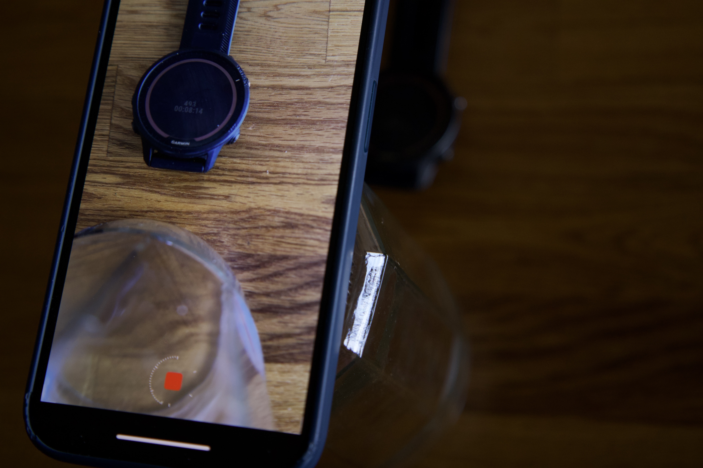

# GarminBytePacking

## Introduction

In this repository we introduce a Garmin library (aka monkey barrel) in `BytePacking/` directory that adds functions for manipulating ByteArrays, Floats, Doubles and Longs.

Here are the core functions (see [here](https://github.com/mannyray/GarminBytePacking/blob/master/BytePackingTesting/source/FloatTest.mc#L100) for the code example):

```javascript
var someLong = 123l;
var byteArray = BytePacking.BPLong.longToByteArray(someLong);
Test.assert(byteArray.equals([0x00,0x00,0x00,0x00,0x00,0x00,0x00,0x7B]b));
Test.assert(BytePacking.BPLong.byteArrayToLong(byteArray) == someLong);

var someFloat = 123.34f;
byteArray = BytePacking.BPFloat.floatToByteArray(someFloat);
Test.assert(byteArray.equals([0x42,0xF6,0xAE,0x14]b));
Test.assert(BytePacking.BPFloat.byteArrayToFloat(byteArray) == someFloat);

var someDouble = 1234578.65432d;
byteArray = BytePacking.BPDouble.doubleToByteArray(someDouble);
Test.assert(byteArray.equals([0x41,0x32,0xD6,0x92,0xA7,0x81,0x83,0xF9]b));
Test.assert(BytePacking.BPDouble.byteArrayToDouble(byteArray) == someDouble);
```

In fact, the `floatToByteArray`/`byteArrayToFloat` pair have already been implemented by Garmin's built in methods to ByteArray data type via [encodeNumber and decodeNumber](https://developer.garmin.com/connect-iq/api-docs/Toybox/Lang/ByteArray.html#encodeNumber-instance_function) (and can be seen tested in this [repo](https://github.com/mannyray/GarminBytePacking/blob/master/BytePackingTesting/source/FloatTest.mc#L14-L23)). However, these methods can only handle number formats of up to 32 bits. This exclusion of 64 bit numbers was the motivation of this library which adds the conversion to Longs and Doubles. Since Floats and Double are similar in their bit structure, the the Float implementation easily led to the Double implementation.

The motivation for the word "packing" was due to the desire to have the ability to pack various variables and data within a single Long or Double. Let me explain with an example: 

> Let's say you have heart rate data (beats per minute - bpm) for each second over 8 second period: `[100bpm, 99bpm, 95bpm, 91bpm, 87bpm, 83bpm, 81bpm, 80bpm ]`. Each of these heart rate numbers can be stored as a byte since the range of a byte is from 0 to 255. Therefore, in bit notation, our array becomes: `[01100100,01100011,01011111,01011011,01010111,01010011,01010001,01010000]` (see this [tool](https://www.rapidtables.com/convert/number/decimal-to-binary.html) for conversion assistance). Then, this array of 64 bits total (8 numbers \* 8 bits per byte) becomes 64 bits and in Double form is equivalent to the number `3.8331240896774276e+175` (see this [tool](https://baseconvert.com/ieee-754-floating-point)). We converted the 8 heart beats to a single Double!

In our example above we are packing heart beat into a single double - why would we do that? Sounds a little convoluted  - no? Garmin apps allow the developer to store data to a FIT data file during activities. Garmin allows the developer to [create _fields_](https://developer.garmin.com/connect-iq/api-docs/Toybox/ActivityRecording/Session.html#createField-instance_function) for each of their various data types (e.g. heart rate), but these can be limiting:
 - You may be restricted by the amount of fields you can create. (see forum post [[1]](https://forums.garmin.com/developer/connect-iq/f/discussion/234758/what-is-the-limiting-number-of-developer-fields-that-can-be-added-under-session), [[2]](https://forums.garmin.com/developer/connect-iq/i/bug-reports/please-can-the-sdk-documentation-be-more-developer-friendly-and-searchable-and-complete), [[3]](https://forums.garmin.com/developer/connect-iq/f/app-ideas/274591/why-the-limitation-to-2-custom-data-fields)). Field count restriction can be difficult if you are trying to store a variety of data types (e.g. not just heart rate data but say also some speed data). Now you can just pack the data into one 64 bit field (or multiple such fields)
 - You may have sub second high frequency data which Garmin's field is [not equipped to handle](https://developer.garmin.com/connect-iq/api-docs/Toybox/FitContributor/Field.html): `If setData() is called before the previous data is written out, the previous value will be lost and replaced by the current data. For this reason, we do not recommend using this feature for time-sensitive data requiring sub-second granularity.`. You can save up your high frequency data over a second period, pack them into a single Double and the save it. (A link to a forum posts of someone trying to handle high frequency data [[1]](https://forums.garmin.com/developer/connect-iq/f/discussion/353139/save-high-frequency-accelerometer-and-gyroscope-data-to-fit-file), [[2]](https://forums.garmin.com/developer/connect-iq/f/discussion/320993/best-practice-to-record-sub-second-data-to-fit-file), [3](https://forums.garmin.com/developer/connect-iq/f/discussion/376050/heartbeatintervals-on-a-data-field))
 - Other alternative approaches to saving the data may not work like logging the data to log file as its limit of 12kb (see [here](https://forums.garmin.com/developer/connect-iq/f/discussion/6311/device-log-size-limitation---alternate-sysout)) may be too small, but you need way more. For example according to [[1]](https://forums.garmin.com/developer/connect-iq/f/app-ideas/274591/why-the-limitation-to-2-custom-data-fields0) and [[2]](https://forums.garmin.com/developer/connect-iq/f/discussion/258441/maximum-memory-for-data-field-per-device), my 955 solar watch has 262kb memory for data fields. In addition, setting up a bluetooth connection to another device, like your cell phone to use it as a data store option while your Garmin devices collects/computes the data may be inconvenient, restrictive or time consuming to implement.
 - This packing approach may not to used just for data fields, but for general efficient memory storage ( see [[1]](https://forums.garmin.com/developer/connect-iq/f/discussion/360245/basic-data-compression-to-save-watch-memory-use#pifragment-1298=1), [[2]](https://forums.garmin.com/developer/connect-iq/f/discussion/6000/preserving-memory-in-monkey-c), [[3]](https://forums.garmin.com/developer/connect-iq/f/discussion/252057/best-practices-for-reducing-memory-usage))

## Example

In the previous section we introduced why we might need to pack various data into a Double. Let's practice with a code example below which is part of our test suite [here](https://github.com/mannyray/GarminBytePacking/blob/master/BytePackingTesting/source/LongTest.mc#L185). In this example we store various data as part of a `BytePacking.BPLongPacked()` object which under the hood used a Long to store the incoming data. This object makes sure we don't attempt to store too much into a single Long. Once we have finished storing we can call `BytePacking.BPLongPacked.getData()` which gives us the Long at which point we can convert it to ByteArray via the code seen at the beginning of this page. From the ByteArray we can convert to a Double.

```javascript
 /*
    We have a few numbers we want to pack into a 64 bit long
*/
var numbers = [
    523l, // 1000001011 - 10 digits
    8129l, // 1111111000001 - 13 digits
    654321l, // 10011111101111110001 - 20 digits
    9237l // 10010000010101 -  14 digits
    ];

// we specify the exact amount of bit digits required for each number
var bitsRequired = [10, 13, 20, 14];
/*
    pad one of the entries with zeros

    this is useful in scenarios where you have a varying data point within some range of
    say [0,255] (8 bit max range), but at times enter in data that doesn't require
    all the bits (say your data is 16 which is 5 binary digits), but for consistency and
    later on processing sake you want to make sure you always use the 8 bits which
    is why you would pad.
*/

bitsRequired[2]+= 1;
// we now have 58 bits to be stored

// Let's starting packing the data into the long:
var packed = new BytePacking.BPLongPacked();
for(var i=0; i<numbers.size(); i++){
    packed.addData(
        BytePacking.BinaryDataPair.binaryDataPairWithMaxBits(
            numbers[i],
            bitsRequired[i]
        )
    );
}

Test.assert(packed.getCurrentBitOccuputation()==58);

/*
    Our number is
    1000001011 1111111000001 0 10011111101111110001 10010000010101
    (that's the 58 up to now and the rest zeros) 000000
    or compacted 1000001011111111100000101001111110111111000110010000010101000000
    which according to
    https://www.rapidtables.com/convert/number/binary-to-decimal.html
    is equivalent to -9007337107100203712

    Out of 64 bits in long, 6 bits are maining as first 58 are used
*/
Test.assert(packed.getData() == -9007337107100203712l);

// we now try to pack something that does not fit into the remaining
// 6 bits ( 64 needs to be represented in 7 bits) and fail
try {
    packed.addData(new BytePacking.BinaryDataPair(64l));
    Test.assert(1 == 0);//should never be reached.
} catch (e instanceof Toybox.Lang.InvalidValueException) {
    var acquiredErrorMessage = e.getErrorMessage();
    var expectedErrorMessage = "We are already storing too much";
    Test.assertMessage(
        acquiredErrorMessage.find(expectedErrorMessage) != null,
        "Invalid error message. Got '" +
        acquiredErrorMessage +
        "', expected: '" +
        expectedErrorMessage +
        "'"
    );
}

//However 32 fits as it is 6 bits, but we first incorrectly try to fit in 5 bits
try {
    packed.addData(BytePacking.BinaryDataPair.binaryDataPairWithMaxBits(32l,5));
    Test.assert(1 == 0);//should never be reached.
} catch (e instanceof Toybox.Lang.InvalidValueException) {
    var acquiredErrorMessage = e.getErrorMessage();
    var expectedErrorMessage = "maxBitCount is less than actual bit count";
    Test.assertMessage(
        acquiredErrorMessage.find(expectedErrorMessage) != null,
        "Invalid error message. Got '" +
        acquiredErrorMessage +
        "', expected: '" +
        expectedErrorMessage +
        "'"
    );
}

/*
    BytePacking.BinaryDataPair.binaryDataPairWithMaxBits can be
    called when wanting a specific bit count
    or you can use the exact bit count needed for the
    long number by calling BytePacking.BinaryDataPair
*/
packed.addData(new BytePacking.BinaryDataPair(32l));

/*
    Our new long in bits is 
    1000001011111111100000101001111110111111000110010000010101100000
*/
Test.assert(packed.getData() == -9007337107100203680l);
Test.assert(packed.getCurrentBitOccuputation()==64);// no more bits left over

/*
    we now extract the byte array of the stored long
    and verify that it is equal to what is expected
*/
var byteArray = BytePacking.BPLong.longToByteArray(packed.getData());
// the bits in hex form
assertEquivalencyBetweenByteArrays(byteArray, [0x82,0xFF,0x82,0x9F,0xBF,0x19,0x05,0x60]b);

/*
    Now that we have the byte array of a long which is 64 bits, we can express it as 
    a double which is also 64 bits long
    value from https://baseconvert.com/ieee-754-floating-point
*/
Test.assert(BytePacking.BPDouble.byteArrayToDouble(byteArray)==-3.0835862373866053e-294d);
```

In the example above, we used a `BytePacking.BPLongPacked()`  object to store the incoming data. The incoming data was in long, integer, format. However, what if we need to store Floats? We can pack two of them into a Double (as seen in our [test code](https://github.com/mannyray/GarminBytePacking/blob/master/BytePackingTesting/source/FloatTest.mc#L82-L96))

```javascript
// using https://baseconvert.com/ieee-754-floating-point
        
var float1 = 1234.1234f; //0 10001001 00110100100001111110011
var float2 = -12345.243687f; //1 10001100 10000001110010011111010

var floatArr1 = BytePacking.BPFloat.floatToByteArray(float1);
var floatArr2 = BytePacking.BPFloat.floatToByteArray(float2);

var singleArr = floatArr1.addAll(floatArr2);
Test.assert(BytePacking.BPDouble.byteArrayToDouble(singleArr)==3.100875655157453e+22d);
```

In general, you can pack anything you want into a Double, as long as it all is within 64 bits.

## Watch App Example:

The examples above don't deal with actually saving to a Garmin data field. In `TestApp/`, we have a simple watch app for the 955 solar that displays "Hello World" and creates and saves a FIT field just with our data.

<center></center>

Files `TestApp.mc`, `TestAppDelegate.mc` and `TestAppView.mc` provide the core structure of our skeleton app while `TestField.mc` provides an extremely basic setup for creating, closing a Garmin data field and saving data to it - there we mention that we are saving the data as as `DATA_TYPE_DOUBLE`:

```javascript
dataField = session.createField(
    "field",
    DATA_FIELD_ID,
    FitContributor.DATA_TYPE_DOUBLE,
    { :mesgType=>Fit.MESG_TYPE_RECORD }
);
```

within `TestApp.mc`'s initialization of the app we create the session for the Garmin field as well as setup a function that will be called regularly in order to save our data. 

```javascript
session = new Session();
/*
    Every 2000 milliseconds (number can't be less than a 1000 
    due to setData restrictions)
*/
timer.start( method(:onTimerTic),2000,true);
```

Within `onTimerTic`, we have the code that is similar to the one we saw in a previous example:
```javascript
var numbers = [523l, 8129l, 654321l, 9237l, 32l];
var bitsRequired = [10, 13, 20, 14, 6];
bitsRequired[2]+= 1;
var packed = new BytePacking.BPLongPacked();
for(var i=0; i<numbers.size(); i++){
    packed.addData(
        BytePacking.BinaryDataPair.binaryDataPairWithMaxBits(
            numbers[i],
            bitsRequired[i]
        )
    );
}
var byteArray = BytePacking.BPLong.longToByteArray(packed.getData());
var dataDoubleEquivalent = BytePacking.BPDouble.byteArrayToDouble(byteArray);
// now that we have converted the data to a double, we save it to FIT file
session.recordData(dataDoubleEquivalent);
```

After running the watch app, you will have generated a FIT file. At this point, I am assuming if you, the reader, are digging this deep then you must be familiar with how to extract the FIT file, generated by this watch app. We load it onto our computer and run the script located in `TestParsing/script.py`:
```python
import fitdecode

with fitdecode.FitReader('2025-02-07-16-28-55.fit') as fit:
    for frame in fit:
        if frame.frame_type == fitdecode.FIT_FRAME_DATA:
            if frame.name == "record":
                value = frame.fields[6].value
                print(value)
```
which will give us the expected value of `-3.0835862373866053e-294` (as seen in our previous example). Now to decode this value into the original numbers we encoded we add the following functions in the python script: `def double_to_binary_string(number)` and `def binary_to_long(binary_string, start_index, end_index)` and parse the `value` variable as follows:

```python
binary_string = double_to_binary_string(value)
# the lengths of data is assumed to be an agreed upon, in advance,
# way of encoding data so that the way data is packed in the Garmin app
# is the same way it will unpacked in this python script
ordered_lengths_of_data = [10, 13, 21, 14, 6]
starting_index = 0
for current_data_length in ordered_lengths_of_data:
    print(binary_to_long(
        binary_string,
        starting_index,
        starting_index+current_data_length
    ))
    starting_index = starting_index + current_data_length
```
which gives us the expected output of:
```
523
8129
654321
9237
32
```
We have thus demonstrated how to go from packing data into a double on the Garmin watch app and save into a FIT file to then opening the FIT file on your computer and extracting the packed data.

## Using the library

Include the monkey barrel in your own project ( as `TestApp/` of this repository does) by following instructions in https://developer.garmin.com/connect-iq/core-topics/shareable-libraries/. This will likely involve editing your project's manifest.xml to include link to the library:

```xml
<iq:barrels>
        <iq:depends name="BytePacking" version="0.0.0"/>
</iq:barrels>
```

In addition, you will have to add a barrels.jungle file of the format:

```bash
# Do not hand edit this file. To make changes run the
# "Configure Monkey Barrels" command.
 
BytePacking = [../BytePacking/monkey.jungle]
base.barrelPath = $(base.barrelPath);$(BytePacking)
```

Now, finally in your code access it via 

```javascript
var someLong = 123l;
var byteArray = BytePacking.BPLong.longToByteArray(someLong);
```

## Small, but important Print!

This small warning is specifically for the functions `BytePacking.BPLong.byteArrayToFloat` and `BytePacking.BPLong.byteArrayToDouble`. It is possible for the 32 or 64 bits (respectively) required to store the decimal value to represent a NaN or Inf. Furthermore, many different bit arrangements can reprsent NaN - in floats, `0.4%` of the possible arrangements are NaNs (see [here](https://stackoverflow.com/questions/19800415/why-does-ieee-754-reserve-so-many-nan-values)). What this means for packing data is that multiple packings can lead to a NaN (potential conflict). I have not tested to see how Garmin's setData deals with NaNs and if the FIT file can distinguish between them, but in general I think it is best to avoid possibility of confusion. 

To avoid NaNs and Infs you have to avoid having the exponent portion of the IEEE 754 (format encoding used by Floats and Double), being all binary "1"s which can we simply avoid by forcing the first and second bit of our Long to be 0 as follows:


```javascript
var packed = new BytePacking.BPLongPacked();
/*
Packing is done in first come first serve order,
so we set the first two bits to 0 right away.
This does remove two bits from our 64 bits worth of packing.
*/
packed.addData(BytePacking.BinaryDataPair.binaryDataPairWithMaxBits(0l,2));
```

## Watch App _REAL LIFE_ Example:

"Alright, alright you saved a single Double to a FIT file...big deal" - you may be thinking. "What about a real world application?"

The difficulty of applying it to your context, will be in constructing a proper data model.

### Case study 1: Exploring Garmin 955 solar and Garmin's setData limitations

I wasn't sure how _much_ actual data I can save in my data field. According to [here](https://forums.garmin.com/developer/connect-iq/f/discussion/258441/maximum-memory-for-data-field-per-device) (and [here](https://github.com/flocsy/garmin-dev-tools/blob/main/csv/device2memory-datafield.csv)), for my specific watch model, it was `262kb` which would mean about `32 000` 8 byte chunks meaning that if I call `setData` at its highest permitted frequency of once a second then I could call it over a `32 000` times for around 9 hours before I run out of memory. However, these were all theoretical numbers - how do I test this?

From our example above, from `TestApp/` (the code for this study is placed in `InvestigationApps/DataSizeTestApp`), I modified the code to call `setData` at the fastest rate of once a second:
```javascript
counter = 0;
// setData() calling onTimerTic gets called every 1000 milliseconds
timer.start( method(:onTimerTic),1000,true); 
```
where in `onTimerTic`, we now just stored a counter:
```javascript
var byteArray = BytePacking.BPLong.longToByteArray(counter);
var dataDoubleEquivalent = BytePacking.BPDouble.byteArrayToDouble(byteArray);
// now that we have converted the data to a double, we save it to FIT file
session.recordData(dataDoubleEquivalent);
counter++;
```

The idea is that once the FIT file is generated, I could parse to test that all of the saved data field entries are increasing by one like they are in the code (`counter++`). If there are jumps of greater than one in between then that means `setData` did not save the data. I had suspicion to test Garmin's `setData` as it seemed a little black-box (mysterious) to me. From the documentation [here](https://developer.garmin.com/connect-iq/api-docs/Toybox/FitContributor/Field.html): `If setData() is called before the previous data is written out, the previous value will be lost and replaced by the current data. For this reason, we do not recommend using this feature for time-sensitive data requiring sub-second granularity.` Was the behaviour of `setData` a little flakey due to `before ... written out, ... value will be lost`? The counter check would help me know this.

If we are expecting to write counters with value in the range of up to `32 000` then that requires about 15 bits worth of binary digits. To double the range (just in case - for padding sake), we can increase bit requirement to 16 bits.

Now, I don't want to spend 9 hours to get my FIT file and only extract counter information. I figured, I could also test `timer.start( method(:onTimerTic),1000,true);`. I would test the exact timestamps at which `onTimerTic` is called based on [`System.getTimer()`](https://developer.garmin.com/connect-iq/api-docs/Toybox/System.html#getTimer-instance_function) to see the function is indeed being called exactly once a second because if it not then it might impact `setData()` functioning. We can get the relative time of the `onTimerTic` call, to the start of app,  in milliseconds. With an estimated `32 000` second (or 9 hour) app duration this means that I would need `32 000 000` millisecond range. To add some buffer, double the expected millisecond range would take up to 26 digits.

We now have 26 binary digits for the timestamp and 16 binary digits for the counter for a total of 42 digits. We add two more digits due to our `Small, but important Print!` section above for a total of 44 digits. Our two code blocks above now become:

```javascript
counter = 0l;
startTimeStamp = System.getTimer().toLong();
timer.start( method(:onTimerTic),1000,true);
```
and
```javascript
var packed = new BytePacking.BPLongPacked();
// nan/inf avoidance
packed.addData(BytePacking.BinaryDataPair.binaryDataPairWithMaxBits(0l,2));
// storing the counter
packed.addData(BytePacking.BinaryDataPair.binaryDataPairWithMaxBits(counter,16));
// storing the relative time stamp
var currentTimeStamp = System.getTimer().toLong();
var relativeTimeStamp = currentTimeStamp - startTimeStamp;
packed.addData(
    BytePacking.BinaryDataPair.binaryDataPairWithMaxBits(relativeTimeStamp,26)
);

var byteArray = BytePacking.BPLong.longToByteArray(packed.getData());
var dataDoubleEquivalent = BytePacking.BPDouble.byteArrayToDouble(byteArray);
// now that we have converted the data to a double, we save it to FIT file
session.recordData(dataDoubleEquivalent);
counter++;
```

After doing a quick test trial run to make sure that the watch app runs and generates an expected FIT file of my specified format, I set the app to run for at least 9 hours to see what happens while I go and do something else.  However, knowing the nature of software development and testing, I was prepared for the option that the FIT file might not save properly for some reason like I went over the file size limit and now the file is gone ( a random worst case hypothetical illustrating 9 fruitless hours ). I decided to modify the view of the watch app to also display the counter and the total running time (with the help of `updateCounterInView`) and film it with a timelapse so that if my watch app crashes then at least the timelapse will tell me when things went wrong.

<center></center>

Fortunately, the app did not crash from lack of enough memory. However, the app ended up using all 16 bits of the counter bit and went way past the expected `32 000` entries and went all the way to `65 535` (which is all the 16 bits set to binary `1`) at which point the app crashed trying to get `65 535 + 1 = 65 536` to fit in 16 bits via `BytePacking.BinaryDataPair.binaryDataPairWithMaxBits(counter,16)`. The experiment took about 18 hours due to the rate of calling `setData()` once a second to generate a `1.5`mb file. I was glad to know that I had tons of room for my FIT files (at least 18 hours worth), and did not care to discover the actual limit as I did not want to run another long experiment.

I next analyzed to see if all of the counters saved to the FIT file were increasing exactly by one without skipping any values. I learned that there were `795` skipped values out of `65 536` which is a `1.2%` skip rate. The biggest skip rate was the skip of a single value - this suggested to me that an existing data was failed to saved as we were rushing to replace with the next counter value: `If setData() is called before the previous data is written out, the previous value will be lost and replaced by the current data. For this reason, we do not recommend using this feature for time-sensitive data requiring sub-second granularity`.

One other thing I observed was the skipped values were not evently spread out across the 18 hour watch app run with all the occurences happening only between `[5500,29500]` (seconds) or equivalently between the 1.5 and 8 hour watch app run time. For these skipped values, I did not have enough data to determine if the non saved entry had a timestamp too close to the previous `setData()` call as the counter along with its timestamp were skipped from recording.

I decided to see if I can get any clues from the timestamps I recorded. Did they occur exactly every 1000 milliseconds as set by `timer.start( method(:onTimerTic),1000,true);`? For the consecutive, non skipping counters, this is a array mapping the time differences between successive `onTimerTic` calls and the total amount of such encounters all ordered by the time difference:

`[(977, 1), (978, 1), (980, 3), (981, 1), (986, 1), (987, 1), (988, 1), (989, 1), (990, 2), (993, 2), (994, 1), (996, 2), (997, 3), (998, 271), (999, 9485), (1000, 44361), (1001, 9497), (1002, 290), (1003, 4), (1004, 1), (1005, 1), (1007, 2), (1009, 1), (1010, 2), (1012, 1), (1014, 2), (1019, 1), (1020, 3), (1021, 1), (1022, 1)]`

The majority of the consecutive calls do occur right after `1000` milliseconds (`44361`), but from the data it can be observed that there is some slight variance with some consecutive calls even happening as soon as `977` or as slow as `1022` milliseconds.

I decided to run another experiment, but this time I wanted to catch the skipped timestamp value. Since any counter could be skipped then I had to make sure the next counter over stored some data about it's previous timestamp so I could later reconstruct the skipped data. I kept the existing 44 bit data structure the same and just appended another 11 bits ( range [`0,2047`] ) of the time difference to the previous timestamp so that if the previous time stamp was not recorded I could just subtract the time difference from the next, recorded, timestamp to get the time.

The experiment ran for about 10 hours this time for a total of `36 000` entries. The skip rate was also around `1.2%`. I checked the new appened 11 bits and discovered that the time difference to the previous timestamp was not some overly low number which would suggest that `setData()` was not given enough time to save the data, but instead was usually a standard `1000` milliseconds. Once again, the max skipped amount was of a single value.

My conclusion here is that `setData()` saves data once a second, but cannot be relied to do so exactly all the time and sometimes takes more than a second to save so that when the next value to be saved comes exactly a second later it might overwrite the previous one. This 'glitch' comes one in every 100 `setData()` calls. From the first experiment of this glitch only happening between 1.5 and 8 hour watch app run time out of total 18 suggested to me that this glitch was not exactly random, but I was not sure how how to debug this issue further.

To avoid losing your 1 in 100 data points you can deploy the following strategy:
 - Be okay with losing your data. Perhaps you don't need all of your data and can just do an average between the two values surrounding the skipped data
 - Don't call `setData()` every `1000` ms. Call it, say, every `1050` ms. After retesting the same app as in this case study but modifying the `setData` call to be every `1050` ms, out of `63911` numbers only `3` were skipped which is a skip rate of `0.004%` (way lower than `1.2%`)
    - This would mean that you will have a buffer in the case if your data to be saved is coming in exactly once a second. If you save data every `1050` ms then to save 20 entries will take `1050*20` ms (equivalently `21` seconds), but you will have 21, once-a-second, data points piling in meaning you will have a buffer of 1 unsaved entry after `20` calls to `setData()`. Therefore, if you run your experiment for `37 800` seconds (10.5 hours), then you will have had made `36 000` calls to `setData()` and have a buffer of size `37 800 - 36 000 = 1 800`. If each data point is `8` bytes then this will be a total of `8*1800=144 00` bytes - which for a watch app for 955 solar (according to [here](https://github.com/flocsy/garmin-dev-tools/blob/main/csv/device2memory-watchApp.csv#L95)) is less than `786 432` watch app memory limit (untested).
 - Instead of packing your data into `64` bits, pack it into the `32` bits and the second half reserve for a duplicate save of the previous data. This way you can always recover the a data point from the bits of the next data point.
 - Experimental approach: Save two data fields simultaneously assuming that if one skips then the other will be unlikely to (_assuming_ independence of field 1 skipping and field 2 skipping in which case the probabilty of both skipping would be `1.2%` of `1.2%`). 


